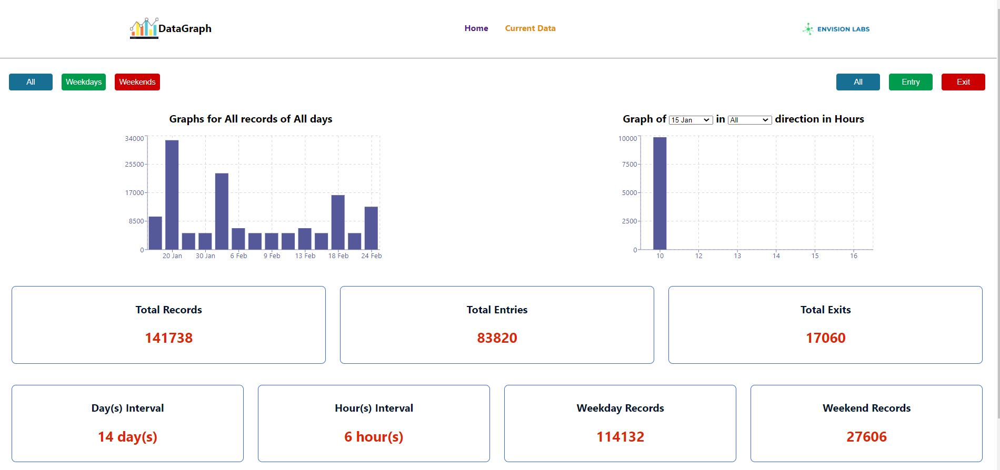

# Envision Code Challenge
* [Description](#description)
* [Usage](#usage)
* [License](#license)
* [Contributing](#contributing)
* [Tests](#tests)
* [Questions](#questions)
## Description
Full Stack application using React JS for frontend and Node/ Express and Mongo DB at the backend to represent Data of persons entering  and exiting place in Melbourne in graphs with some filtering facilities

## Usage
* `Home` Page shows overall data
*  `Current Data` Page shows on the left Graphs for all records per day, can be filtered using the buttons at the top 
  *  On the right see horluy traffic into the place filtered by date and direction
* At the bottom there is  some cards with some statistical information about all records

## Contributing

## Tests

## Questions
You are welcome to provide any feedback and/or ask questions.
Please, send any question to my e-mail [tonymelek.au@gmail.com](mailto:tonymelek.au@gmail.com) and/or visit my profile on [Github](https://github.com/tonymelek)

## License
The project is protected under MIT,you may need to read through license conditions